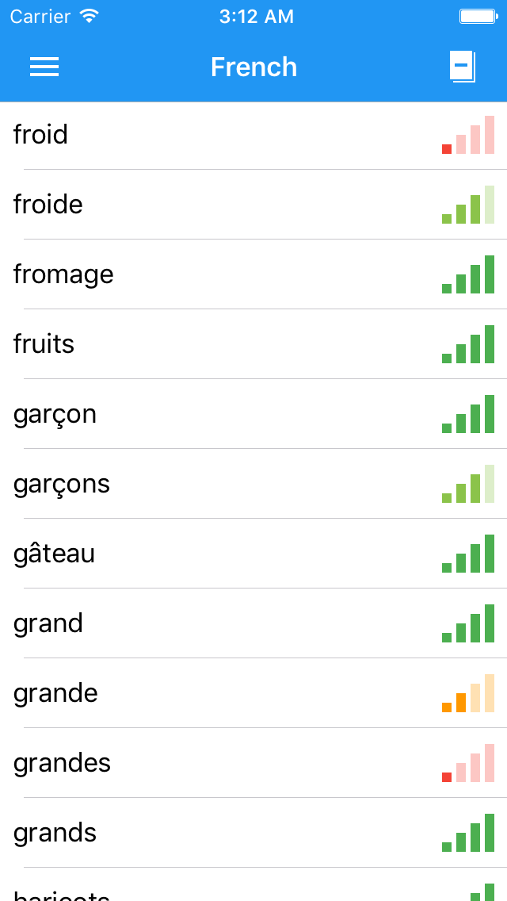

# Flashcards

Unofficial mobile client for https://www.duolingo.com/.
Allows viewing list of known words, and reviewing them via flashcards. (this functionality is missing from their mobile app)

Use your Duoling login and password to login.
If you don't have one but want to preview app use the following one: appiumtest/appiumtest

|Android|iOS|
|---|---|
|||
|<a href='https://play.google.com/store/apps/details?id=com.triangleleft.flashcards&hl=en&utm_source=global_co&utm_medium=prtnr&utm_content=Mar2515&utm_campaign=PartBadge&pcampaignid=MKT-Other-global-all-co-prtnr-py-PartBadge-Mar2515-1'></a>|TBD|

## Cross-Platform
All business logic is placed into separate java-only module (called "core"). Android app, simply includes it as jar dependency, while for iOS it is translated by [j2objc](http://j2objc.org/) into Obj-C code that is then compiled and packaged into .framework (type of library for iOS projects).
Translation and compilation are done using [j2objc-gradle](https://github.com/j2objc-contrib/j2objc-gradle) plugin.
Packaging into framework is done by custom makefile (core/Makefile)

This app uses vector graphics only, so they too are shared between Android and iOS.
As I am targeting API 16, during build of Android app, aapt generates multiple png images for each dpi. For iOS we need only three types: 1x (mdpi), 2x (xhdpi), 3x (xxhdpi). They are packaged into .assets file (core/assets.mk) that is included into XCode project.

## Tests
All unit tests within "core" module are also translated to ObjC and run automatically during building of framework. (to make sure that translated code also works as expected)

UI testing is done using [appium](http://appium.io/). Test are mostly platform independent (with the exception of keyboard uage). To interact with ui elements I use "pages": abstract objects with fields representing elements on screen. Mapping is done using annotations, which one is used depends on the current driver.
```java
    @AndroidFindBy(id = "com.triangleleft.flashcards:id/flashcard_translation")
    @iOSFindBy(accessibility = "flashcard_translation")
    public WebElement translation;
```
As appium is black-box testing so in order to mock network responses we build a special version of app with endpoint replaced to adress of local server. (Ideally one should use proxy or custom DNS server to intercept requests and test release version of app)
To run UI tests for Android:
* start appium server
* start android emulator
* build appium variant of app  (`./gradlew :app:assembleAppium`)
* run appium tests (`./gradlew :appium:androidTest`)

To run UI tests for iOS: (broken as of 04.10.16 due to XCode 8 update)
* start appium server
* start iOS simulator
* build and install appium varion of app using XCode
* run appium tests (`./gradlew :appium:iosTest`)

## Bulding and running

To build Android version:
* `./gradlew assembleRelease`

To build iOS version
* `./build_framework.sh`
* Use XCode to build